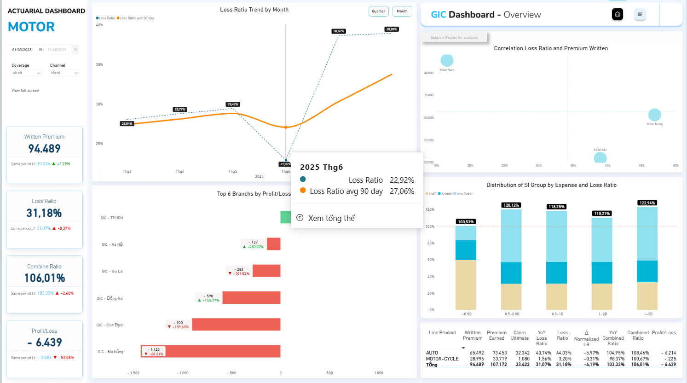
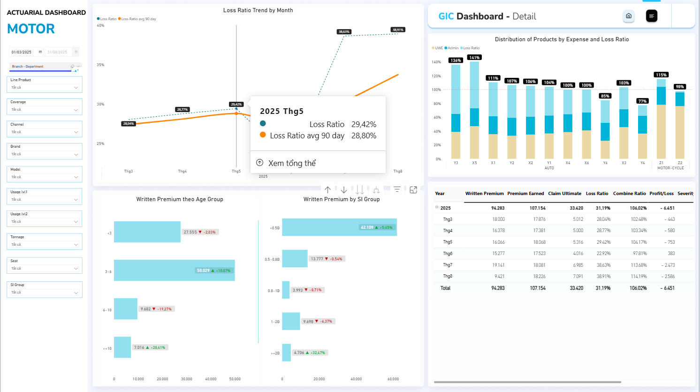
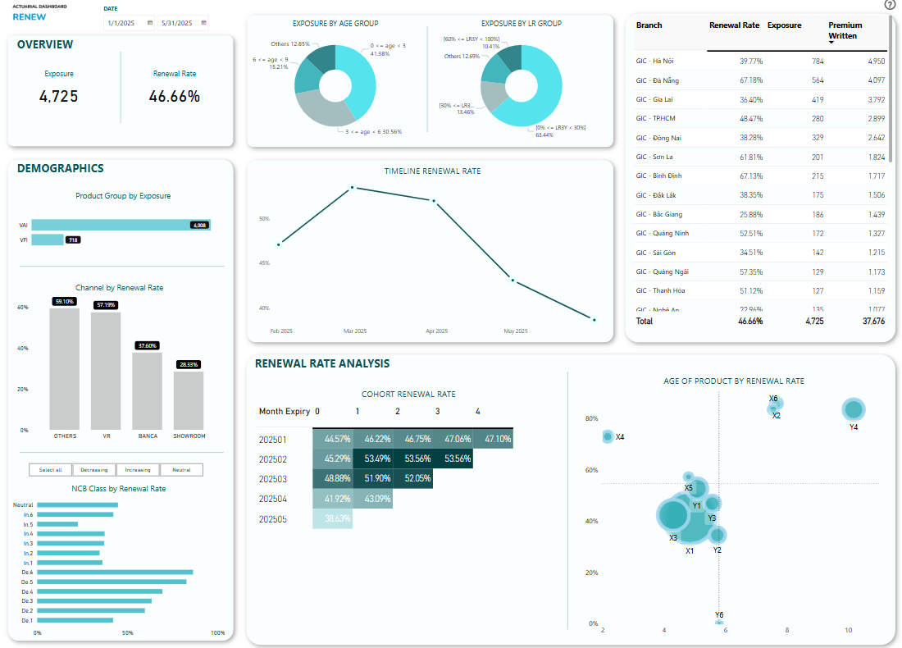

# 👋 Hello, I'm Nam!
Welcome to my data portfolio. I'm currently working as an Actuarial Analyst at GIC with a strong focus on Business Intelligence, Data Engineering and Data Analyst.

## 📊 Projects

### [1. Motor Actuarial Dashboard Daily - ETL with MS Fabric](https://github.com/dovannam115/ETL_Motor_Project/tree/main)
- Built interactive dashboards to visualize pricing and renewal KPIs.
- Automated daily data pipeline from SQL Server to Microsoft Fabric using Spark.
- Used Lakehouse to manage data storage and governance.
  
_**Note**: The data shown in this dashboard is simulated and does not represent the company's actual data, in order to maintain confidentiality and comply with data protection policies._

The first part of the dashboard provides a company-wide overview to help stakeholders quickly grasp the overall performance.

### 2. Renewal Performance Dashboard (Power BI)
- Designed an interactive dashboard to monitor renewal performance across business units, time periods, and loss ratio groups.
- Visualized key metrics such as overall renewal rate, top 5 units by exposure, and performance scatter plots.
- Implemented advanced Power BI features like drill-down, conditional formatting, and custom tooltips.
- Data was sourced from SQL Server and refreshed on a scheduled basis for up-to-date reporting.

_**Note**: The data shown in this dashboard is simulated and does not represent the company's actual data, in order to maintain confidentiality and comply with data protection policies._

This dashboard enables teams to identify retention opportunities and evaluate the impact of claims on customer behavior.

## 📬 Contact
- Email: dovannama5qtk48@gmail.com
- LinkedIn: [nam-do-b74250222](https://www.linkedin.com/in/nam-do-b74250222/)
